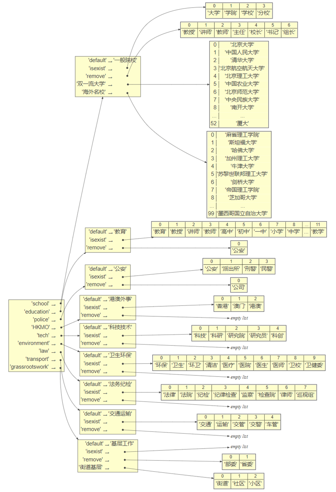

# parser
extract the directory `parser` to `Career_Platform`.

run `python demo.py` to test the rule-based label classifier.  
We've tested the Rule-based classifier on a practical dataset involving 2578 resumes. The result shows that 2152 resumes had been labeled. Apart from those only labeled with '深圳', there're still 1274 valid resumes.  
here is the rule-structure.  

